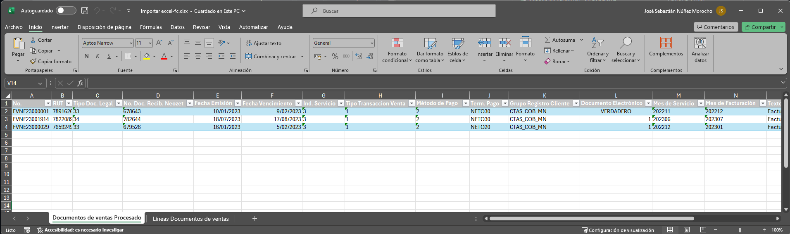

# java-development-playground

## Importar excel FC

Este documento consta de dos hojas: Documentos de ventas Procesado y Líneas Documentos de ventas.
La idea central es poder leer la información en el archivo excel y poder devolverla en un formato json.

Hoja1: Documentos de ventas Procesado
<p align="center">
  
</p>

Hoja2: Líneas Documentos de ventas
<p align="center">
  
</p>

1. **Pruebas en Postman**:
   ```bash
    curl --location 'http://localhost:8080/api-playground/excel/import-excel-fc' \
   --form 'file=@"postman-cloud:///1eeebeeb-8834-4ae0-94b0-e763e37c3e01"'
  
  El resultado debería verse de esta manera:
   ```bash
    {
    "docVentaProcesados": [
        {
            "nroDocumento": "FVNE23000001",
            "rut": "78916260-3",
            "tipoDocumentoLegal": "33",
            "nroDocumentoReciboNeozet": "678643",
            "fechaEmision": "1/10/23",
            "fechaVencimiento": "2/9/23",
            "indServicio": "3",
            "tipoTransaccionVenta": "1",
            "grupoRegistroCliente": "CTAS_COB_MN",
            "documentoElectronico": "TRUE()",
            "mesServicio": "202211",
            "mesFacturacion": "202212",
            "textoRegistrado": "Factura Mixta",
            "glosaPrincipal": "SERVICIOS &amp; CONSULTORIAS SPA 678643",
            "nroSuministroActivo": "1179",
            "codOrigenUsuario": "Factura MASIVO",
            "creadoPor": "MASIVO",
            "metodoPago": "2",
            "termPago": "NETO30"
        },
        {
            "nroDocumento": "FVNE23001914",
            "rut": "78220890-K",
            "tipoDocumentoLegal": "34",
            "nroDocumentoReciboNeozet": "782644",
            "fechaEmision": "7/18/23",
            "fechaVencimiento": "8/17/23",
            "indServicio": "3",
            "tipoTransaccionVenta": "1",
            "grupoRegistroCliente": "CTAS_COB_MN",
            "documentoElectronico": "1",
            "mesServicio": "202306",
            "mesFacturacion": "202307",
            "textoRegistrado": "Factura Exenta",
            "glosaPrincipal": "MAESTRANZA S&amp;B LIMITADA 782644",
            "nroSuministroActivo": "1188",
            "codOrigenUsuario": "Factura MASIVO",
            "creadoPor": "MASIVO",
            "metodoPago": "2",
            "termPago": "NETO30"
        },
        {
            "nroDocumento": "FVNE23000029",
            "rut": "76592495-2",
            "tipoDocumentoLegal": "33",
            "nroDocumentoReciboNeozet": "679526",
            "fechaEmision": "1/16/23",
            "fechaVencimiento": "2/5/23",
            "indServicio": "3",
            "tipoTransaccionVenta": "1",
            "grupoRegistroCliente": "CTAS_COB_MN",
            "documentoElectronico": "1",
            "mesServicio": "202212",
            "mesFacturacion": "202301",
            "textoRegistrado": "Factura Afecta",
            "glosaPrincipal": "SOCIEDAD CONCESIONARIA AEROPUERTO CARRIEL SUR S.A. 679526",
            "nroSuministroActivo": "1082",
            "codOrigenUsuario": "Factura MASIVO",
            "creadoPor": "MASIVO",
            "metodoPago": "2",
            "termPago": "NETO20"
        }
    ],
    "lineaDocVentas": [
        {
            "nroDocumento": "FVNE23000001",
            "nroLinea": "1",
            "tipoCodigo": "Item",
            "nroProducto": "PROD990001",
            "descripcion": "CARGO POR ENERGIA Noviembre 2022 (2.440,200 kWh)",
            "descripcionDos": "",
            "cantidad": "1.00",
            "precioUnitario": "187,418.00",
            "indiceExe": "4",
            "ppto": "",
            "unidadNegocio": "",
            "linea": "",
            "region": ""
        },
        {
            "nroDocumento": "FVNE23000001",
            "nroLinea": "2",
            "tipoCodigo": "Item",
            "nroProducto": "PROD990003",
            "descripcion": "CARGO POR DEMANDA HORA PUNTA (4,100 kW)",
            "descripcionDos": "",
            "cantidad": "1.00",
            "precioUnitario": "29,407.00",
            "indiceExe": "4",
            "ppto": "",
            "unidadNegocio": "",
            "linea": "",
            "region": ""
        },
        {
            "nroDocumento": "FVNE23000001",
            "nroLinea": "3",
            "tipoCodigo": "Item",
            "nroProducto": "PROD990005",
            "descripcion": "CARGO TRANSMISION NACIONAL, SEGMENTO NACIONAL (2.440,200 kWh)",
            "descripcionDos": "",
            "cantidad": "1.00",
            "precioUnitario": "3,285.00",
            "indiceExe": "4",
            "ppto": "",
            "unidadNegocio": "",
            "linea": "",
            "region": ""
        },
        {
            "nroDocumento": "FVNE23000001",
            "nroLinea": "4",
            "tipoCodigo": "Item",
            "nroProducto": "PROD990006",
            "descripcion": "CARGO TRANSMISION NACIONAL, EXENCIONES PEAJES DE I (2.440,200 kWh)",
            "descripcionDos": "",
            "cantidad": "1.00",
            "precioUnitario": "7,330.00",
            "indiceExe": "4",
            "ppto": "",
            "unidadNegocio": "",
            "linea": "",
            "region": ""
        },
        {
            "nroDocumento": "FVNE23000001",
            "nroLinea": "5",
            "tipoCodigo": "Item",
            "nroProducto": "PROD990007",
            "descripcion": "CARGO TRANSMISION NACIONAL, PAGO PEAJES DE RETIROS (2.440,200 kWh)",
            "descripcionDos": "",
            "cantidad": "1.00",
            "precioUnitario": "4,754.00",
            "indiceExe": "4",
            "ppto": "",
            "unidadNegocio": "",
            "linea": "",
            "region": ""
        },
        {
            "nroDocumento": "FVNE23000001",
            "nroLinea": "6",
            "tipoCodigo": "Item",
            "nroProducto": "PROD990008",
            "descripcion": "CARGO TRANSMISION ZONAL (2.440,200 kWh)",
            "descripcionDos": "",
            "cantidad": "1.00",
            "precioUnitario": "32,747.00",
            "indiceExe": "4",
            "ppto": "",
            "unidadNegocio": "",
            "linea": "",
            "region": ""
        },
        {
            "nroDocumento": "FVNE23000001",
            "nroLinea": "7",
            "tipoCodigo": "Item",
            "nroProducto": "PROD990009",
            "descripcion": "SSCC RECURSO TECNICO (3.064,705 kWh)",
            "descripcionDos": "",
            "cantidad": "1.00",
            "precioUnitario": "24,011.00",
            "indiceExe": "4",
            "ppto": "",
            "unidadNegocio": "",
            "linea": "",
            "region": ""
        },
        {
            "nroDocumento": "FVNE23000001",
            "nroLinea": "8",
            "tipoCodigo": "Item",
            "nroProducto": "PROD990010",
            "descripcion": "CARGO SOBRECOSTOS (3.064,705 kWh)",
            "descripcionDos": "",
            "cantidad": "1.00",
            "precioUnitario": "4,609.00",
            "indiceExe": "4",
            "ppto": "",
            "unidadNegocio": "",
            "linea": "",
            "region": ""
        },
        {
            "nroDocumento": "FVNE23000001",
            "nroLinea": "9",
            "tipoCodigo": "Item",
            "nroProducto": "PROD990011",
            "descripcion": "COMP. PRECIO ESTABILIZADO (3.064,705 kWh)",
            "descripcionDos": "",
            "cantidad": "1.00",
            "precioUnitario": "7,248.00",
            "indiceExe": "4",
            "ppto": "",
            "unidadNegocio": "",
            "linea": "",
            "region": ""
        },
        {
            "nroDocumento": "FVNE23000001",
            "nroLinea": "10",
            "tipoCodigo": "Item",
            "nroProducto": "PROD990028",
            "descripcion": "CARGO POR SERVICIO PUBLICO (2.440,200 kWh)",
            "descripcionDos": "",
            "cantidad": "1.00",
            "precioUnitario": "1,240.00",
            "indiceExe": "3",
            "ppto": "",
            "unidadNegocio": "",
            "linea": "",
            "region": ""
        },
        {
            "nroDocumento": "FVNE23001914",
            "nroLinea": "1",
            "tipoCodigo": "Item",
            "nroProducto": "PROD990034",
            "descripcion": "OTROS CARGOS ASOCIADOS A LOS RETIROS Junio 2023",
            "descripcionDos": "",
            "cantidad": "1.00",
            "precioUnitario": "52,311.00",
            "indiceExe": "3",
            "ppto": "",
            "unidadNegocio": "",
            "linea": "",
            "region": ""
        },
        {
            "nroDocumento": "FVNE23000029",
            "nroLinea": "1",
            "tipoCodigo": "Item",
            "nroProducto": "PROD990031",
            "descripcion": "CARGO POR INTERESES Diciembre 2022 (Ref: Folio 9519)",
            "descripcionDos": "",
            "cantidad": "1.00",
            "precioUnitario": "2,846.00",
            "indiceExe": "4",
            "ppto": "",
            "unidadNegocio": "",
            "linea": "",
            "region": ""
        }
    ]
}
